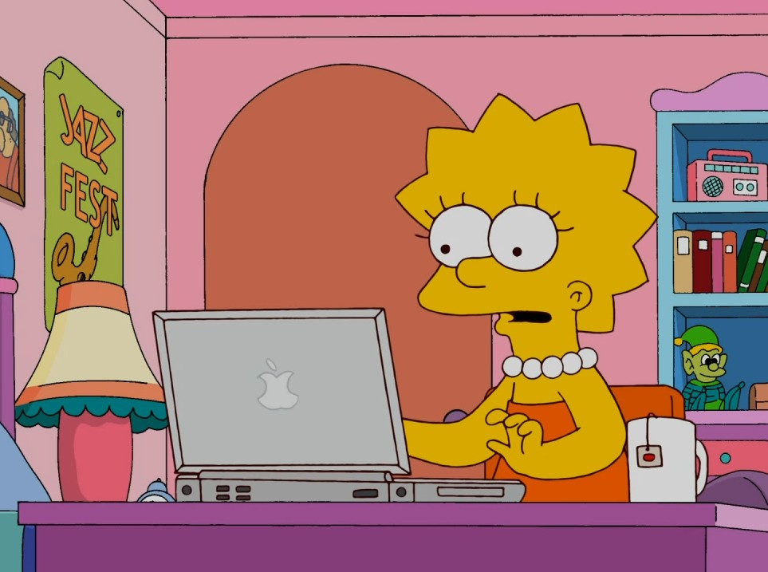

```{r configuracion, include = FALSE}
library(knitr)
library(tidyverse)
library(datos)
library(fontawesome)
library(xaringanExtra)
# set default options
opts_chunk$set(echo=FALSE,
               warning=FALSE,
               collapse = TRUE,
               dpi = 300)
knit_engines$set("yaml", "markdown")

xaringanExtra::use_tile_view()
xaringanExtra::use_clipboard()
xaringanExtra::use_share_again()
xaringanExtra::style_share_again(
  share_buttons = c("twitter", "linkedin", "pocket")
)
```

class: right, middle, inverse, titular
background-image: url(https://www.eltiempo.com/files/image_640_428/uploads/2019/12/16/5df803eda01af.jpeg)
background-size: contain
background-position: -20% 0%


# `r rmarkdown::metadata$title` 
## `r rmarkdown::metadata$subtitle` 
### `r rmarkdown::metadata$author`
### `r rmarkdown::metadata$date`

---

class: middle, center

# Sobre la Unidad 1


### 1. ¿Qué entendemos por filosofía de la ética y de la moral?
### 2. Principios éticos y morales.
### 3. Código morales. Los dilemas morales.
### 4. La ética y la moral en la vida cotidiana y en el aula.

---

class: middle, center, inverse

`r fontawesome::fa("users", height = "4em")`
# ¿Qué entendemos por filosofía de la ética y de la moral?

---

background-image: url(https://i.pinimg.com/originals/35/4e/fa/354efaf04e4e3737bc1d684838a94b0a.jpg)
background-size: cover


---


# `r fontawesome::fa("chess-queen")` Ética y moral

<br>
<br>

### Los seres humanos actuamos de acuerdo con las muchas experiencias que se nos van presentando a lo largo de la vida. El carácter de una persona está integrado por hábitos que la llevan a realizar determinados actos en benefi cio o en perjuicio propios, por tanto es común preguntarse constantemente si lo que estamos haciendo está bien o no y qué consecuencias puede tener. Este pensamiento forma parte de la formación ética y moral con la que fuimos educados.

---

class: right, middle, inverse, titular
background-image: url(https://www.sicologiasinp.com/wp-content/uploads/2017/12/diferencias-etica-moral-2-750x350.jpg)
background-size: cover

---

# Ética

La ética (del griego _êthos_ que primitivamente significaba “lugar donde se habita” y que posteriormente Aristóteles la definió como la manera de ser o el carácter) es una rama de la filosofía considerada como el conjunto de principios, valores, costumbres y normas que rigen la conducta humana, mismas que son adquiridas, asimiladas y practicadas de un modo estrictamente racional o consciente. Hablar de eticidad es referirse al individuo y a su relación con la comunidad, la forma en que actúa y el tipo de regulaciones y valores que establece y comparte con las personas para ser reconocido dentro de un mismo círculo social. 

# Moral

El término “moral”, etimológicamente proviene del latín _mores_ que significa “costumbres”. La moral es un conjunto de principios, valores y normas de conducta que son adquiridos o asimilados dentro del medio en que se interactúa (desde la comunidad hasta la escuela misma) y cuya práctica depende más de un sentimiento de respeto hacia la autoridad que los impone, que puede ser el padre de familia o un profesor.

---

# `r fontawesome::fa("chess-queen")` ¿Es lo mismo ética que moral…?

La **moral** da pautas para la vida cotidiana, mientras que la **ética** es una reflexión sobre qué origina y justifica dichas pautas, pero ambas son complementarias. Los principios éticos regulan el comportamiento moral y, por lo general, los conflictos morales aparecen cuando se requiere tomar una decisión, lo cual nos lleva a realizar una reflexión de nivel ético.

Aranguren llama a la ética **moral pensada** y a la moral **moral vivida** y ejemplifica lo ético y lo moral con el siguiente cuadro:


| Estamos en el nivel moral cuando: | Estamos en el nivel ético cuando: |
|:----------------------:|:----------------------:|
| Cumplo una promesa hecha ayer pese a que hoy me doy cuenta de que su cumplimiento me crea problemas. | Razonamos que los pactos han de cumplirse siempre, de lo contrario, en lugar de acuerdos entre amigos, tendríamos que hacer contratos legales. |
| Ayudo voluntariamente a un compañero de clase si bien me arriesgo a herir su orgullo. | Me pregunto qué tiene más valor moral, si la intención que inspira un acto o los resultados que con él se obtienen. |
| Decido si tengo que ser o no sincero con un compañero de clase que al parecer quiere ser mi amigo. | Reflexiono sobre valores preguntándome si el valor de la autenticidad es preferible al valor de la amistad. |
| Rechazo robar la calculadora de un compañero de clase sabiendo que nadie me ve. | Tengo presente la máxima regla de oro: “No hagas a los demás lo que no quieres que te hagan a ti”. |

---

## `r fontawesome::fa("thumbtack")` Dialoguemos

.pull-left[
.center[
]]

.pull-right[
### Lee el siguiente texto que plantea un dilema y coméntalo con tus compañeros:

#### Tienes programado un examen de una materia muy difícil y en la que tus notas no han sido muy satisfactorias, por lo que requieres aprobarlo y únicamente hay una fecha para presentarlo. Pero el día del examen es el mismo día que tu grupo de música favorita se presenta en un concierto y tus compañeros consiguieron boletos de primera fila para asistir. Será el único concierto porque el grupo ya no volverá a presentarse.

#### ¿Tú qué harías...? ¿Mentirías para que te dejen ir al concierto diciendo que el examen se pospuso o presentarías el examen? Si asistes al concierto, ¿te sentirías culpable por no haber presentado el examen o por haber ido al concierto?
]

