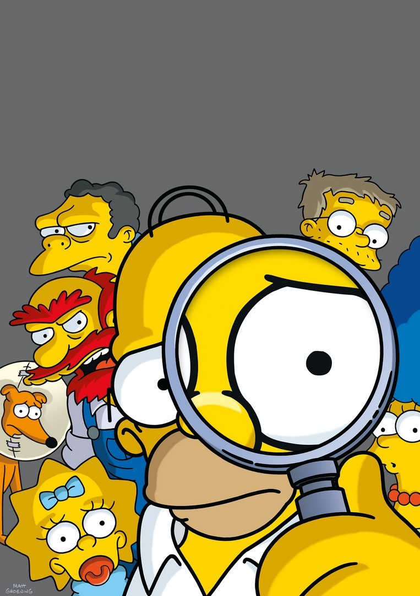

```{r configuracion, include = FALSE}
library(knitr)
library(tidyverse)
library(datos)
library(fontawesome)
library(xaringanExtra)
# set default options
opts_chunk$set(echo=FALSE,
               warning=FALSE,
               collapse = TRUE,
               dpi = 300)
knit_engines$set("yaml", "markdown")

xaringanExtra::use_tile_view()
xaringanExtra::use_clipboard()
xaringanExtra::use_share_again()
xaringanExtra::style_share_again(
  share_buttons = c("twitter", "linkedin", "pocket")
)
```

class: right, middle, inverse, titular
background-image: url(https://www.eltiempo.com/files/image_640_428/uploads/2019/12/16/5df803eda01af.jpeg)
background-size: contain
background-position: -20% 0%


# `r rmarkdown::metadata$title` 
## `r rmarkdown::metadata$subtitle` 
### `r rmarkdown::metadata$author`
### `r rmarkdown::metadata$date`

---

class: middle, center

# Sobre la Unidad 1


### 1. ¿Qué entendemos por filosofía de la ética y de la moral?
### 2. Principios éticos y morales.
### 3. Código morales. Los dilemas morales.
### 4. La ética y la moral en la vida cotidiana y en el aula.

---

class: middle, center, inverse

`r fontawesome::fa("users", height = "4em")`
# Códigos morales
# Los dilemas morales

---

background-image: url(https://img.ecartelera.com/noticias/56700/56715-m.jpg)
background-size: cover

---

# `r fontawesome::fa("chess-queen")` Códigos morales

.left-column[
.center[
]
]

.right-column[
Los códigos morales existen desde que el hombre empezó a vivir en sociedad. Todo grupo cuenta con un código moral que refleja los valores buenos o malos, lo que se puede hacer y lo que está prohibido. Entendemos que los códigos morales son una serie de acuerdos que un ser humano debe cumplir para asegurar su supervivencia en un grupo social. 

Los individuos hemos aprendido que cuando se han llevado a la práctica los acuerdos sobre códigos
de conducta logra sobrevivir, por tanto se obliga a acatarlos. Un ejemplo de código moral es nuestra Constitución Política, en ella se establecen ciertos lineamientos que rigen al país y que controlan las “conductas” de los que en él habitamos.

Cuando estos códigos no son respetados es una transgresión y se convierte en un **acto hostil**. Ahora bien, cuando una persona no comunica que ha hecho algo indebido por temor a las consecuencias de sus actos se le llama **ocultación**.
]

---

## `r fontawesome::fa("thumbtack")` Actividad 1

Busquen un anuncio de un periódico digital en el que se haga presente una situación referente
a algún código moral; péguenlo en el tablero y comenten acerca de las acciones realizadas por las personas involucradas. Por ejemplo:

.center[

]

---

## `r fontawesome::fa("thumbtack")` Actividad 2

### 1.¿Cuáles son los códigos morales que se manejan en tu familia? ¿Quién o quiénes los implementan?

### 2. ¿Los consideras adecuados? Explica tu punto de vista.

### 3. ¿Qué códigos morales requieren ser implementados entre tus amigos y por qué?


## Para concluir…

_Los códigos morales fortalecen la conducta positiva del ser humano, cuando un código no es respetado se convierte en un acto hostil que no sólo perjudica a la sociedad sino al individuo mismo._


---

# `r fontawesome::fa("chess-queen")` Los dilemas morales

Los dilemas son narraciones breves de algún conflicto que encierra un problema de valor; es decir, una persona necesita elegir la mejor alternativa para superar una situación difícil. 

Confrontar opiniones, perspectivas y puntos de vista permite replantearse nuevas ideas y reestructurar el pensamiento acerca de cuestiones morales.

Para discutir un dilema pueden seguirse las siguientes orientaciones:

**1. Presentar el dilema mediante la lectura o con imágenes.** La lectura puede realizarse de manera individual o en grupo y también es posible utilizar imágenes o dibujos.

**2. Recapitulación.** Es necesario comprobar que el dilema ha sido comprendido y hacer hincapié en lo que debería hacer el protagonista.

**3. Reflexión individual.** Reflexionar acerca del dilema y seleccionar una alternativa. 

**4. Discusión del dilema.** Se puede comentar de manera general y exponer las respuestas y los argumentos para posteriormente organizar una discusión en pequeños grupos.

**5. Final de la actividad.** Exponer las posturas y soluciones planteadas a partir de lo cual se puedan establecer situaciones similares a las del dilema.

---

## `r fontawesome::fa("thumbtack")` Actividad 3

#### Lee el siguiente dilema y organiza una discusión tomando en cuenta las orientaciones planteadas con anterioridad y regístralas en tus notas. 

Una mujer estaba a punto de morir de cáncer. Según los doctores existía un medicamento que la podía salvar. Se trataba de una forma de “radio” que un farmacéutico de la ciudad había descubierto recientemente. El medicamento era muy caro de producir, pero el farmacéutico lo vendía 1000% arriba de su costo. El costo original era de doscientos dólares, pero él cobraba dos mil dólares por una pequeña dosis. El marido de la mujer enferma recurrió a todos lados para reunir la cantidad que hacía falta, pero sólo pudo reunir mil dólares. Le dijo al farmacéutico que su mujer se moría, que le vendiera el medicamento y que posteriormente le pagaría lo que le faltaba. Pero el farmacéutico le dijo que no, que él había descubierto el medicamento y que quería sacar dinero de ello. De esta forma el esposo se desesperó y empezó a pensar en entrar al almacén del farmacéutico y robar el medicamento para su mujer. ¿Debería robar el medicamento para su esposa?

## `r fontawesome::fa("thumbtack")` Actividad 4

#### Plantea un dilema y compártelo con tus compañeros para que elijan una alternativa.


_El individuo considera sus propios valores para enfrentar los dilemas morales dilucidando entre lo que es correcto e incorrecto._

