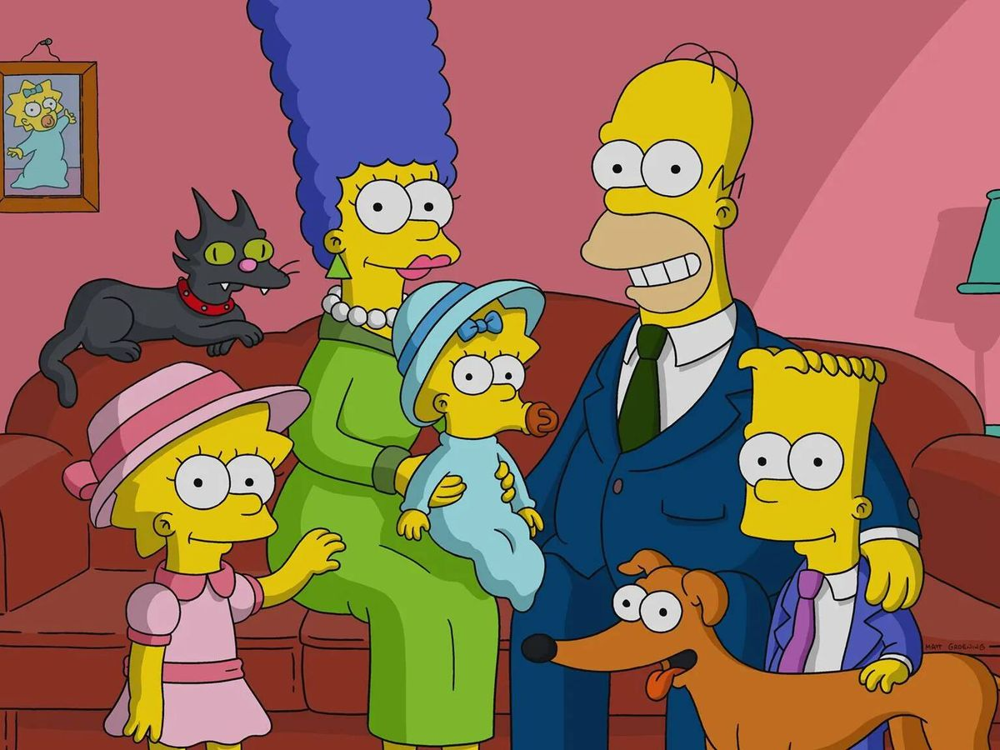

```{r configuracion, include = FALSE}
library(knitr)
library(tidyverse)
library(datos)
library(fontawesome)
library(xaringanExtra)
# set default options
opts_chunk$set(echo=FALSE,
               warning=FALSE,
               collapse = TRUE,
               dpi = 300)
knit_engines$set("yaml", "markdown")

xaringanExtra::use_tile_view()
xaringanExtra::use_clipboard()
xaringanExtra::use_share_again()
xaringanExtra::style_share_again(
  share_buttons = c("twitter", "linkedin", "pocket")
)
```

class: right, middle, inverse, titular
background-image: url(https://www.eltiempo.com/files/image_640_428/uploads/2019/12/16/5df803eda01af.jpeg)
background-size: contain
background-position: -20% 0%


# `r rmarkdown::metadata$title` 
## `r rmarkdown::metadata$subtitle` 
### `r rmarkdown::metadata$author`
### `r rmarkdown::metadata$date`

---


class: middle, center, inverse

`r fontawesome::fa("users", height = "4em")`
# La ética y la moral en la vida cotidiana y en el aula

---

background-image: url(https://img.asmedia.epimg.net/resizer/PMj5uap_2blgSFb0F-VwgPXVNoM=/1952x1098/cloudfront-eu-central-1.images.arcpublishing.com/diarioas/AAMYKZHONVA4HLPFU3MTZ2IUEU.jpg)
background-size: cover

---

# `r fontawesome::fa("chess-queen")` La vida cotidiana

.pull-left[
.center[
]
]

.pull-right[
### La sociedad y la cultura han sido factores importantes para entender la conducta del individuo, estas permiten entender y evaluar de manera precisa las formas de ser y actuar ante diversas situaciones cotidianas.

#### Actualmente el crecimiento desmesurado de la sociedad, los problemas económicos, sociales y laborales son elementos que han influido en la modificación de algunos valores, ejemplo claro de ello es la sobrepoblación de los infractores en los cárceles del país, problema que aún sigue en la mesa, pues continúa el incremento de delitos (asesinatos, secuestros, robos, inseguridad etcétera) solo basta echar una mirada a los diarios del país para informarnos de lo que sucede.
]

---

# `r fontawesome::fa("chess-queen")` Los grupos sociales

.pull-left[
.center[
]
]

.pull-right[
### Un grupo social es un conjunto de personas que desempeñan roles recíprocos dentro de la misma sociedad. Los grupos sociales han existido a lo largo de la historia, algunos de ellos se han organizado para luchar contra la discriminación, otros a favor de la igualdad y la equidad; otros más se han reunido en torno al crimen y el narcotráfico, lo cual se refleja en la inseguridad que hoy se vive.
]

---

class: middle, center

.center[

.pull-left[


#### Promover la protección y el bienestar de los animales

<br>


#### Organización que se enfoca en acciones a favor de las poblaciones LGBTI (Lesbianas, Gay, Bisexuales, Transgeneristas e Intersexuales) de Ecuador
]

.pull-right[


#### Confederación de Nacionalidades Indígenas del Ecuador es la organización indígena más grande de Ecuador

<br>


#### Red multidisciplinaria de becarios ecuatorianos que gestiona proyectos en beneficio de sus miembros para el desarrollo sostenible del Ecuador
]
]


---

# `r fontawesome::fa("chess-queen")` La familia


### Desafortunadamente la violencia ha existido siempre, es la lucha por el poder del más fuerte frente al más débil. En la actualidad el problema de la violencia ha alcanzado a las familias ecuatorianas, lo cual ha provocado, desintegración, abandono y adicciones, dejando a un lado los valores familiares y morales que hemos estudiado.

### En la actualidad existen casos de jóvenes que a muy temprana edad (desde los 12 años) se convierten en madres, mientras que otras optan por el aborto o por entregar a su bebé en adopción; en el peor de los casos hay quienes lo abandonan en cualquier lugar.

---

background-image: url(https://images.squarespace-cdn.com/content/v1/579745bd15d5dbda8ada061d/0560f0c8-443b-48bc-8ec2-7a772ebee590/web.jfif)
background-size: cover

---

.center[

]

---

# `r fontawesome::fa("thumbtack")` Actividad 1

### ¿Cuáles son las características éticas y morales que rigen a los grupos sociales identificados en la página anterior?.


# `r fontawesome::fa("thumbtack")` Actividad 2

### De acuerdo con los datos anteriores si ustedes fueran asambleístas de este país, ¿qué propondrían para minimizar alguna de estas problemáticas?


---

# `r fontawesome::fa("chess-queen")` El aula

.pull-left[
.center[
]
]

.pull-right[
#### La escuela es un espacio en el cual los jóvenes interactúan, opinan, debaten, pero principalmente adquieren conocimientos que les permiten enfrentar los retos que les demanda la misma sociedad; es un espacio en que las relaciones interpersonales desempeñan un papel primordial y en el que los alumnos conocen distintos modos de ser aunque en algunos casos no estén de acuerdo con ellos. 

#### La diversidad de ideas, tanto de los docentes como de los propios alumnos puede dificultar o facilitar el trabajo, por lo cual es oportuno crear acuerdos que permitan una mejor relación entre docentes y estudiantes.
]

---

# `r fontawesome::fa("chess-queen")` Estudio de Caso

### 1. Cree una cuenta en Twitter [https://twitter.com/?lang=es](https://twitter.com/?lang=es).

### 2. Investigue sobre alguno de los siguientes temas, escoja solo uno:

#### 1. Xenofobia en Ecuador
#### 2. La lucha de los pueblos indígenas
#### 3. La protesta social
#### 4. Cualquier otro problema social que identifique y que le interese investigar un poco.

### 3. Sobre el tema escogido deberá contruir un hilo en Twitter de mínimo 8 tweets, donde explique acerca del tema. En su relato, no pierda de vista los principios éticos que se encuentran en la Declaración Universal de los Derechos Humanos de las Naciones Unidas (1948).

---

# `r fontawesome::fa("chess-queen")` Estudio de Caso

### 4. Su relato debe incluir estadísticas actualizadas, imágenes, links a páginas relacionadas que complementen su relato, gifs, menciones y hashtags.

### 5. El relato debe ser propio, original y acoplado a la realidad del Ecuador. Cuide la ortografía.

### 6. Algunos ejemplos:

 - [https://twitter.com/PatoAviador/status/1536894872308916225](https://twitter.com/PatoAviador/status/1536894872308916225)

 - [https://twitter.com/martin_ayerbe/status/1536347974741004288](https://twitter.com/martin_ayerbe/status/1536347974741004288)
 
 - [https://twitter.com/ElenaDeQuito/status/1536028626625470465](https://twitter.com/ElenaDeQuito/status/1536028626625470465)

 - [https://twitter.com/JuanRamonGtz/status/1535655236471332865](https://twitter.com/JuanRamonGtz/status/1535655236471332865)
 
 - [https://twitter.com/koldobain/status/1536766422138888194](https://twitter.com/koldobain/status/1536766422138888194)