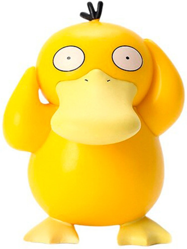

```{r configuracion, include = FALSE}
library(knitr)
library(tidyverse)
library(datos)
library(fontawesome)
library(xaringanExtra)
# set default options
opts_chunk$set(echo=FALSE,
               warning=FALSE,
               collapse = TRUE,
               dpi = 300)
knit_engines$set("yaml", "markdown")

xaringanExtra::use_tile_view()
xaringanExtra::use_clipboard()
xaringanExtra::use_share_again()
xaringanExtra::style_share_again(
  share_buttons = c("twitter", "linkedin", "pocket")
)
```

class: right, middle, inverse, titular
background-image: url(https://wallpaperforu.com/wp-content/uploads/2021/08/Wallpaper-Pokemon-Wallpaper-Pokemon-Minimalism-Squirtle44.jpg)
background-size: contain
background-position: -20% 0%


# `r rmarkdown::metadata$title` 
## `r rmarkdown::metadata$subtitle` 
### `r rmarkdown::metadata$author`
### `r rmarkdown::metadata$date`


---


class: middle, center

# Sobre la Unidad 2


### 1. El juicio moral como base de las decisiones personales. Elementos fundamentales del juicio moral.
### 2. ¿Es lo mismo para todos, la libertad?. Los problemas éticos.
### 3. Los valores, ¿Quién soy? ¿Quién quiero ser?.


---


class: middle, center, inverse

`r fontawesome::fa("users", height = "4em")`
# El juicio moral como base de las decisiones personales

---

background-image: url(https://areajugones.sport.es/wp-content/uploads/2018/07/Pok%C3%A9mon.jpg)
background-size: cover

---

# `r fontawesome::fa("chess-queen")` ¿Qué es la moral?

Es el conjunto de valores que atribuimos a un sistema de creencias que ayuda a las personas a definir lo que es correcto y lo que es incorrecto; no obstante, la moral ha cambiado a través del tiempo porque las sociedades también han cambiado, incluso los conceptos morales, juicios y prácticas también varían de una sociedad a otra.


# `r fontawesome::fa("chess-queen")` ¿Qué es el juicio moral?

Es el acto mental que afirma o niega el valor moral de alguna situación o comportamiento y es a través del cual se pretende buscar la verdad; se pronuncia sobre la presencia (o ausencia) de un valor ético en un momento dado y poco a poco se va construyendo. 

Desde que nacemos hay una base en nuestro juicio moral que,
conforme vamos creciendo, se va ampliando y enriqueciendo de acuerdo con el entorno. Cada uno de nosotros decidimos las actitudes a tomar con base en lo que pensamos sobre lo que es bueno y lo que es malo, hacemos un análisis detallado del entorno y ciertas circunstancias, lo cual nos lleva a adoptar tres tipos de actitudes: **rechazo, indiferencia y aceptación**.


---

# `r fontawesome::fa("thumbtack")` Actividad 1

### A tu grupo llega un alumno que está infectado de VHS-SIDA. Todos en el grupo le huyen porque temen ser contagiados. Tú sabes que esa enfermedad no se contagia, así que decides juntarte con él y, si no llegaran a ser amigos, relacionarse como buenos compañeros para realizar las actividades de la prepa. Y TÚ, ¿QUÉ HARÍAS…?

### a) En caso de que tus compañeros te dejen de hablar porque que te hiciste amigo del alumno nuevo.

### b) Si la maestra de física te pide que hables con otros dos compañeros de la clase para que hagan un trabajo en equipo con el alumno nuevo.

#### Para concluir...
Hasta aquí podemos entender que es responsabilidad de cada persona formarse un juicio para cada situación, lo cual depende de la propia reflexión sobre los principios morales para luego decidir libremente la forma de actuar.

---

# `r fontawesome::fa("chess-queen")` Elementos fundamentales del juicio moral

Los juicios morales son los que realizan las personas; son voluntarios, libres, conscientes, se fijan en la conducta del hombre y por lo tanto son tema de estudio de la ética. Los elementos del juicio moral son las motivaciones, los medios, los fines, las intenciones, las consecuencias y las causas.

.pull-left[

## Motivaciones. 
Tienen que ver con la reflexión ética. Actualmente pensar en las motivaciones que llevan a una persona a actuar de tal o cual manera cobra relevancia, sobre todo porque día a día nos encontramos con hechos que son difíciles de explicar; situaciones que escapan a la comprensión humana porque lastiman y hacen daño a miles de personas: narcotráfico, guerras, terrorismo, discriminación, etcétera.

]

.pull-right[

## Fines e intenciones. 
Los motivos están íntimamente ligados a la intención o a la finalidad ya que buscan proyectar la acción a futuro. Tienen que ver con lo que se persigue y son los instrumentos necesarios para actuar.

## Medios. 
Se refieren al camino que habrá de seguirse para conseguir los fines que se han planteado.

]

---

# `r fontawesome::fa("chess-queen")` Elementos fundamentales del juicio moral

.pull-left[

## Causas. 
Son las razones de fondo que llevan a actuar de una u otra manera; es decir a tener un juicio moral.

]

.pull-right[

## Consecuencias. 
Tienen que ver con el acto moral. Cada acto se valora de acuerdo con el código moral vigente. Son las repercusiones que surgen a partir de una decisión tomada.
]

# `r fontawesome::fa("thumbtack")` Actividad 2

### Analicemos la protesta social actual, indica ejemplos de las motivaciones, fines e intenciones, medios, causas y consecuencias.

---


# `r fontawesome::fa("chess-queen")` Tomar decisiones de manera responsable es lo mejor

.left-column[
<br>
<br>
.center[
]
]

.right-column[
Tener ciudadanos responsables para la toma de decisiones es el ideal de toda sociedad. La persona que responde por sus actos acepta racional y libremente ser el autor de sus propias acciones y así asume las consecuencias de las mismas, sean buenas o malas. 

En un acto humano, una persona puede darse cuenta o ser consciente del mismo, aceptar la participación de los beneficios y, de ser necesario, comprometerse a la reparación del daño generado. Un acto responsable está basado en la racionalidad y la libertad, elementos esenciales para que las personas respondan por lo que hacen, además de que esto les permite alcanzar un cierto nivel moral. Para lograr un acto de nivel moral es necesario tener cultura de responsabilidad. 

La toma de decisiones debe apoyarse en información amplia y veraz la cual, como ya se dijo, ayudará a tener más elementos de juicio y, llegado el momento, aportará las bases requeridas para decidir de manera responsable.
]

---

# `r fontawesome::fa("thumbtack")` Actividad 3

### Formaremos equipos de cinco estudiantes y deberán comentar qué tipo de información requieren para tomar decisiones respecto a los temas que se mencionan en el cuadro. Anótenla en la columna de la derecha, investiguen sus fuentes y analicen cada situación.


| Decisiones sobre: | Información que necesitas |
|:------------------|:-------------------------:|
|Elección vocacional|  |
|Sexualidad         |  |
|Adicciones         |  |


### Escriban dos argumentos que consideren fundamentales para explicar por qué es importante que la sociedad cuente con ciudadanos responsables para la toma de decisiones.

